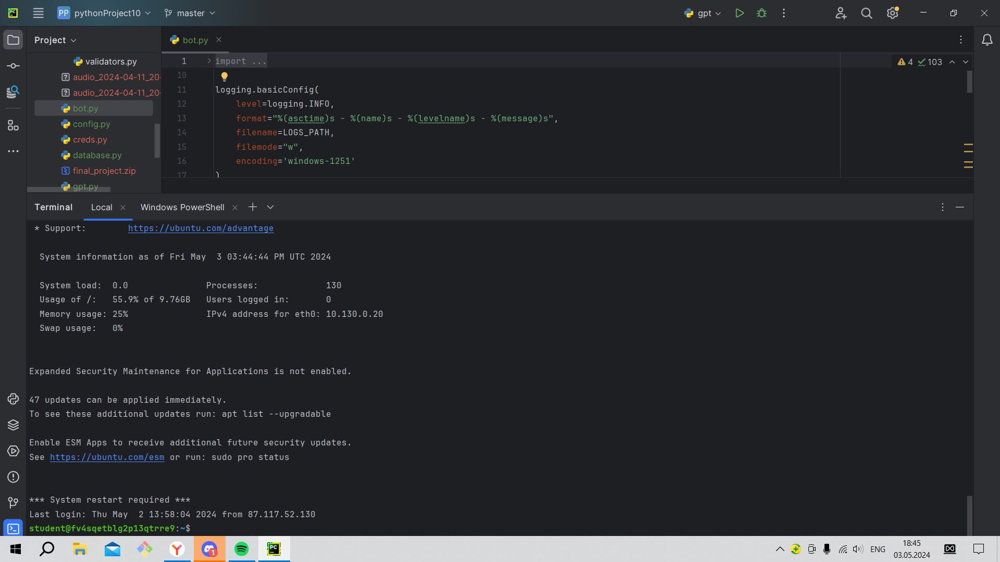
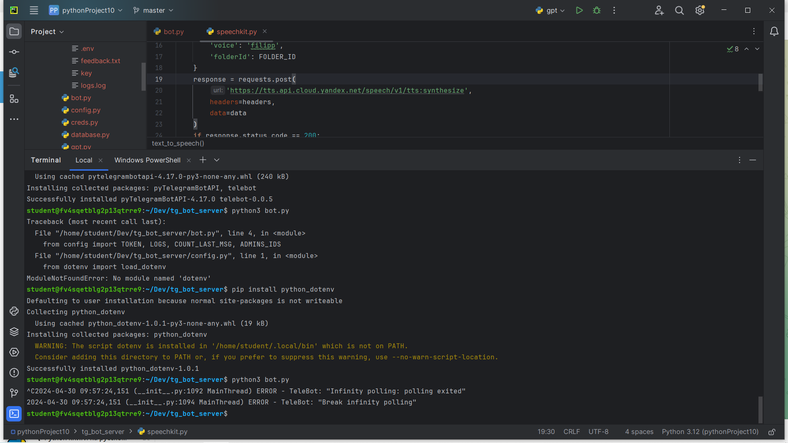

# Бот для Практикума

### [Репозиторий на github](https://github.com/FreddyFazberUrUr/tg_bot_server.git)

## Функции бота
### Бот умеет:
1. Превращать текст в аудио и наобборот
2. Отвечать удобным вам способом(голосовое сообщение или текст)
3. Сохранять логи и отзывы
4. Отвечать на вопросы с помощью GPT
5. Использовать бд

Также у бота есть ограничения на токены, tts символы и stt блоки

## Запуск бота на сервере
Чтобы запустить бота на сервере, нам нужны:
1. ssh-ключ
2. публичный_IP-адрес_ВМ
3. имя пользователя

### Пишем команду в терминал:

```ssh -i <путь_к_ключу> <имя_пользователя>@<публичный_IP-адрес_ВМ>```

Если все получилось, перед глазами должна быть такая картинка:

Далее клонируем репозиторий на сервер командой

```git clone https://github.com/FreddyFazberUrUr/tg_bot_server.git```

Устанавливаем pip

```sudo apt install python3-pip```

Переходим в папку с проектом

```cd tg_server_bot```

Устанавливаем библеотеки

```pip install -r requirements.txt```

Далее все просто: создаем папку creds, в нее добавляем .env, а в .env командой ```nano .env``` вставляем
```
TOKEN=твой_telegramm_токен
IAM_TOKEN=твой_iam_токен
FOLDER_ID=твой_folder_id
ADMINS_IDS=[твой_id_в_telegramm]
```

Запускаем файл bot.py (обязательно нужно перейти в директорию tg_bot_server)

```python3 bot.py```

Если все нормально, должно быть так:



Ура! Бот работает!
